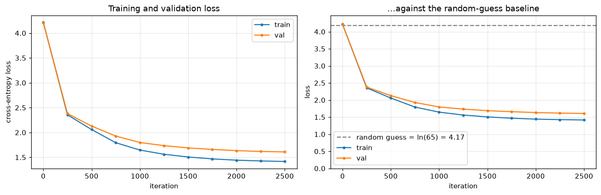
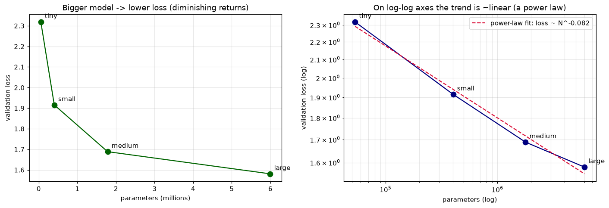
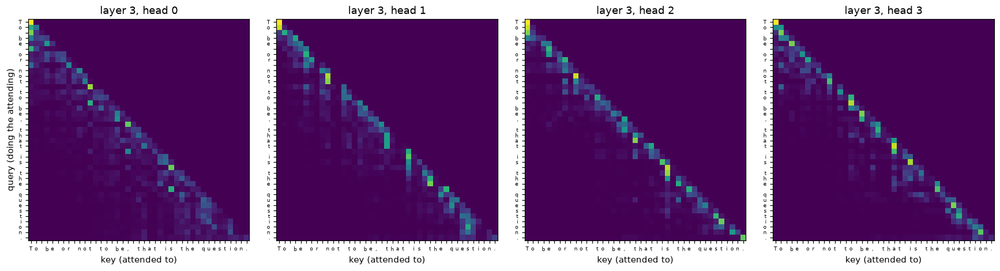
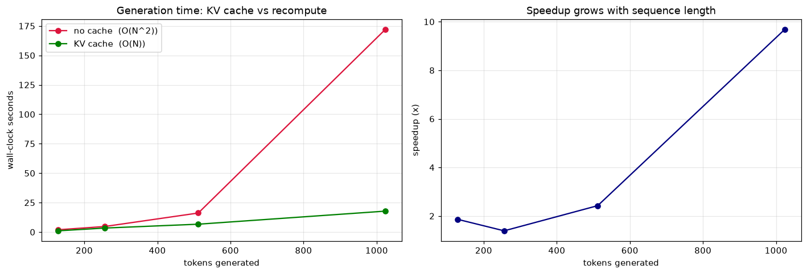

# Transformer from Scratch — a GPT you can actually explain

A GPT-style **decoder-only transformer** built entirely in raw PyTorch — no Hugging Face for the
model, no `nn.Transformer`, no black boxes. Every component is derived, commented, and
demonstrated in a sequence of teaching notebooks, then consolidated into a clean
`model.py` / `train.py` / `sample.py`.

The goal isn't just "it runs." It's that after reading the notebooks you could **whiteboard
attention from memory**, explain *why* every design choice was made (and what the alternative
was), and answer the transformer questions in an ML interview cold.

Two models are trained end-to-end:
- **TinyShakespeare**, character-level, ~0.8M params — trains in minutes on a laptop (Apple MPS
  or any GPU); used for all the small-scale experiments.
- **TinyStories**, with our **from-scratch BPE tokenizer**, ~25M params — trains on Colab and
  produces genuinely coherent English (notebook 08).

---

## What's inside

```
model.py     # GPT: CausalSelfAttention, MLP, Block, GPT, KV-cache + sampling in generate()
bpe.py       # byte-level BPE from scratch (naive + fast incremental trainer) + CharTokenizer
train.py     # training loop: AdamW, cosine+warmup LR, grad clip/accum, mixed precision
sample.py    # CLI: greedy / temperature / top-k / top-p, with the KV cache
notebooks/   # the writeup — 8 executed notebooks, derivation + real outputs (read these)
assets/      # generated plots: loss curves, scaling law, attention maps, KV-cache speedup
data/        # corpora + tokenized .bin files (downloaded/generated by the notebooks)
checkpoints/ # trained weights
```

## The notebooks (read them in order)

Each notebook explains **why we did this and why not that**, with runnable code and real outputs —
plots, tables, hand-checked numeric examples.

| # | Notebook | What you'll understand |
|---|---|---|
| 01 | [Tokenizer](notebooks/01_tokenizer.ipynb) | char-level baseline → **byte-level BPE from scratch**; the naive algorithm, its two flaws (cross-word merges, O(N) per merge), and the fast incremental fix. Byte-level = no `<unk>` ever. |
| 02 | [Attention](notebooks/02_attention.ipynb) | attention built in stages from a **hand-checked toy example**: Q/K/V, scaled dot-product, causal mask, softmax, multi-head. Why √dₖ. Verified against PyTorch's fused kernel. |
| 03 | [Architecture](notebooks/03_transformer_architecture.ipynb) | MLP (why 4×, why GELU), residuals + **pre-norm** (measured vs post-norm), positional embeddings (why attention needs them), weight tying, the full forward pass. |
| 04 | [Training](notebooks/04_training.ipynb) | the loop from scratch: AdamW + selective weight decay, **cosine LR with warmup**, grad clipping, grad accumulation, mixed precision. Trains the Shakespeare model, plots loss. |
| 05 | [Sampling](notebooks/05_sampling.ipynb) | greedy / temperature / top-k / **top-p**, each implemented by hand with plots of how it reshapes the next-token distribution, plus side-by-side samples. |
| 06 | [Scaling & attention](notebooks/06_scaling_and_attention.ipynb) | a **mini scaling law** (val loss vs params, power-law fit) trained across 4 sizes, and **attention-map visualizations** of the trained model. |
| 07 | [KV cache & upgrades](notebooks/07_kv_cache_and_upgrades.ipynb) | the **KV cache** (verified identical output, **measured speedup**), plus RMSNorm, SwiGLU, and RoPE each explained with a working module and a numeric demo. |
| 08 | [TinyStories (Colab)](notebooks/08_tinystories_colab.ipynb) | scale the *same* code to a ~25M model on TinyStories with our own BPE → coherent English. |

---

## Quick start

```bash
python -m venv .venv && source .venv/bin/activate
pip install -r requirements.txt

# train the Shakespeare model (minutes on MPS/GPU, longer on CPU)
python train.py

# generate from it, combining sampling strategies + KV cache
python sample.py --ckpt checkpoints/shakespeare_char.pt --prompt "ROMEO:" \
    --temperature 0.8 --top_k 40 --max_new_tokens 400
```

Or just open the notebooks in order — they regenerate everything (data, tokenizer, checkpoints,
plots) as they run.

---

## The architecture in one screen

A decoder-only transformer is a stack of identical blocks operating on a **residual stream**
(shape `(batch, tokens, n_embd)` throughout):

```
tokens ─► token embedding + positional embedding
          │
          ├─► Block × N:   x = x + MultiHeadCausalAttention(LayerNorm(x))   # tokens communicate
          │                x = x + MLP(LayerNorm(x))                        # per-token compute
          │
          └─► final LayerNorm ─► LM head (tied to token embedding) ─► logits over vocab
```

The load-bearing ideas, each derived in the notebooks:

- **Attention** = `softmax(mask(QKᵀ/√dₖ))·V` — a data-dependent weighted average of value vectors.
  The causal mask makes it left-to-right; √dₖ keeps softmax out of its saturated, zero-gradient
  regime. *(nb 02)*
- **Residual + pre-norm** give gradients a clean identity path down the stack — the difference
  between a 40-layer network training and not (we measure ~10⁸× more gradient reaching the bottom
  layer with pre-norm). *(nb 03)*
- **Weight tying** shares the embedding matrix with the output head — fewer params, better loss.
  *(nb 03)*
- **KV cache** turns O(N²) generation into O(N) by never recomputing past keys/values. *(nb 07)*

---

## Results

*(All small-scale results are produced on an Apple-silicon laptop via MPS; the plots below are
regenerated by the notebooks.)*

**TinyShakespeare (char-level, ~0.8M params).** Trained 2500 steps in ~11 min on Apple MPS;
best validation cross-entropy **1.61** (vs `ln(65) = 4.17` for random guessing).



Sample (temperature 0.8, top-k 40) — note the learned play structure: ALL-CAPS speaker names,
colon-terminated cue lines, Elizabethan diction, mostly-real words, all from next-*character*
prediction alone:

```
Thy solder charge are cousin,
Be father charge the done to them of your work:
The makess applace more fliends of you
To have this of love and hand me with gentleman.

KING RICHARD II:
I will think but me, that's didreas?

Third Murderer:
And, sir, by banish'd complose, do you, goo mat cen my,
```

**Mini scaling law** — val loss falls as an approximate power law in parameter count; straight-ish
on log-log axes, with diminishing returns. *(notebook 06)*



**Attention maps** — what the trained heads actually look at (previous-token heads, an
attention-sink on the first token). *(notebook 06)*



**KV-cache speedup** — bit-identical output, with a measured wall-clock speedup that grows with
sequence length (the O(N²)→O(N) signature): on a 19M-param model at 1024 context this laptop shows
**~2.4× at 512 tokens and ~9.7× at 1024 tokens**. *(notebook 07)*



**TinyStories (~25M params, our BPE)** — coherent short stories; see notebook 08 for samples and
the training curve.

---

## Interview cheat-sheet

Answers derived in the notebooks — this is the "why" you can defend:

- **Why divide attention scores by √dₖ?** Dot products of dₖ-dim vectors have std ~√dₖ; unscaled,
  softmax saturates to argmax and gradients vanish. *(nb 02)*
- **Why the causal mask?** So a token can't attend to the future; without it the model "cheats"
  at train time and collapses at generation. *(nb 02)*
- **What do multiple heads buy you?** Parallel, specialized attention patterns at the same
  parameter cost as one wide head. *(nb 02)*
- **Pre-norm vs post-norm?** Pre-norm keeps LayerNorm off the residual highway → stable gradients
  at depth, tolerant of high LR. *(nb 03)*
- **Why does a transformer need positional embeddings?** Self-attention is permutation-equivariant
  — order-blind without them. *(nb 03)*
- **What is weight tying?** Reuse the token-embedding matrix as the output head: fewer params +
  regularization. *(nb 03)*
- **Why warmup + cosine LR?** Warmup protects the early steps while Adam's moments settle; cosine
  decay settles into a minimum. *(nb 04)*
- **Which params skip weight decay, and why?** 1-D params (LayerNorm gains, biases) — decaying
  scale/shift knobs toward zero fights the model. *(nb 04)*
- **Top-k vs top-p?** k fixes the *number* of candidates; p fixes the cumulative *probability*, so
  the candidate set adapts to the model's confidence. *(nb 05)*
- **What is a KV cache and why not cache queries?** Cache past keys/values (fixed once computed);
  past queries produced already-emitted tokens and are never reused. O(N²)→O(N). *(nb 07)*
- **RoPE vs learned positions?** RoPE encodes *relative* position and extrapolates beyond the
  training context. *(nb 07)*

---

## Credits

Architecture and training recipe follow the GPT-2 / nanoGPT lineage (Karpathy). All code here is
written from scratch for understanding; the notebooks are the original contribution — the
derivations, demonstrations, and "why not that" reasoning are the point.
